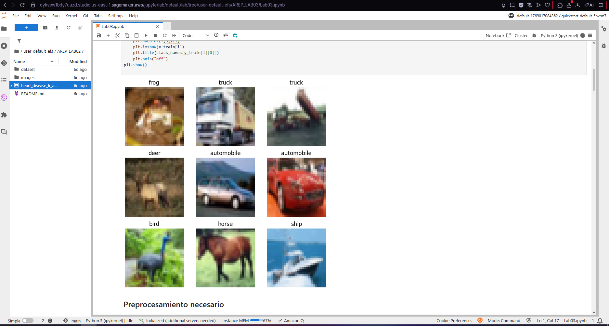
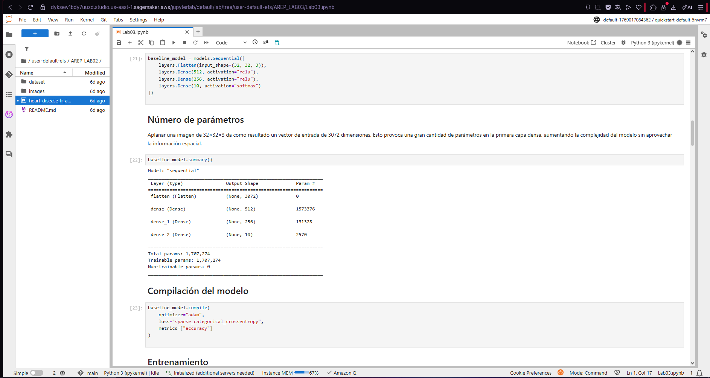
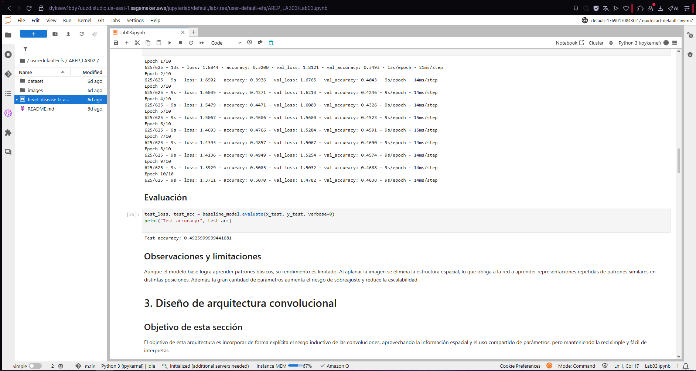
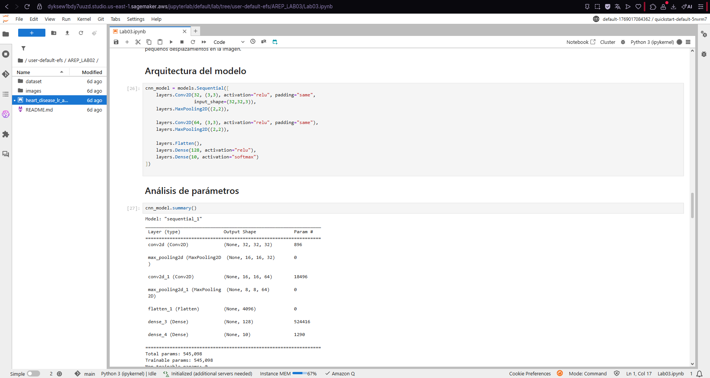
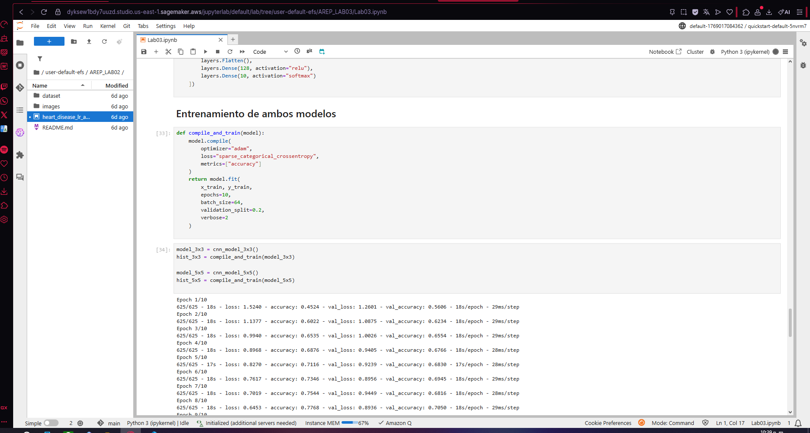

# AREP_LAB03
Este proyecto consiste en el diseño, entrenamiento y evaluación de una Red Neuronal Convolucional (CNN), con el objetivo de analizar cómo el tamaño del kernel en la capa convolucional afecta el rendimiento del modelo. Se realizaron experimentos controlados comparando kernels 3×3 y 5×5, manteniendo constantes los demás hiperparámetros.

## Introducción
Estas instrucciones permiten ejecutar el proyecto localmente para fines de desarrollo, entrenamiento y evaluación del modelo. El laboratorio está orientado a la experimentación académica y análisis de resultados.

## Requisitos previos
Antes de ejecutar el proyecto, es necesario contar con las siguientes herramientas instaladas:

- Python 3.8 o superior
- pip (gestor de paquetes de Python)
- Entorno virtual (opcional pero recomendado)

Librerías principales:

- TensorFlow / Keras
- NumPy
- Matplotlib

Ejemplo de instalación de dependencias:
```
pip install tensorflow numpy matplotlib
```

## Instalación
Siga los pasos a continuación para configurar el entorno de desarrollo:

1. Clonar el repositorio del proyecto
```
git clone https://github.com/Yojhan-Toro/AREP_LAB03.git
```

2. Acceder al directorio del proyecto desde VS Code
```
cd AREP_LAB03
```
## Ejecución de las pruebas
El laboratorio incluye pruebas experimentales para evaluar el desempeño del modelo bajo diferentes configuraciones de la capa convolucional.

## Pruebas end-to-end
Estas pruebas entrenan la CNN completa y evalúan su desempeño en el conjunto de prueba, midiendo métricas como:

- Precisión (accuracy)
- Pérdida (loss)

Ejemplo: 

```
Accuracy kernel 3x3: 0.6936
Accuracy kernel 5x5: 0.6945
```
## Despliegue
Este proyecto está orientado a uso académico y no requiere despliegue en producción. Puede ejecutarse localmente o en entornos como Jupyter Notebook, Google Colab o máquinas virtuales con soporte para Python y TensorFlow.

## Desarrollado con
- Python – Lenguaje principal
- TensorFlow / Keras – Construcción y entrenamiento de la CNN
- NumPy – Manejo de datos numéricos
- Matplotlib – Visualización de resultados

## Despliegue en Amazon SageMaker
A continuación se muestran algunos pantallazos del proceso de despliegue del modelo:







## Autores
- Yojhan Toro Rivera - Desarrollo del laboratorio y análisis de resultados